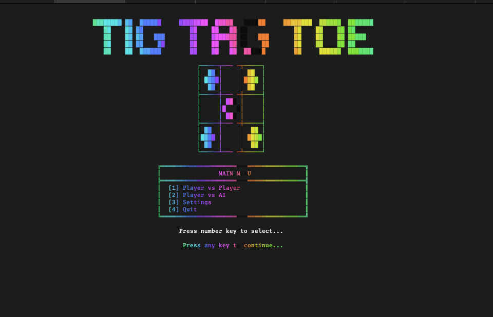

# ai-first-program
This is the first time using claude code.  Very cool.

I got it to build at a tic-tac-toe application that runs in the terminal. Very cool.
Learning alot about agents and how to "Program" the agents to utilize tools, and create workflows.

